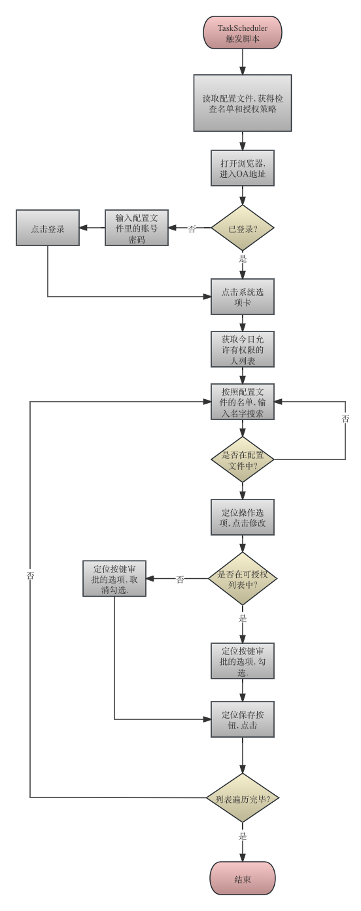

# oa_auth_assignment_script
My python script for specific OA process. To give auth to different person due day of the week.

## 目录

[toc]

## 需求详情

* 进入OA首页, 检查是否在登录状态
* 如果不在登录状态, 需要进行登录
* 使用Json配置文件, 配置一个人员名单, 在名单内的人员纳入管理范围
* 每天定时启动一次, 逐个检查名单内的人员, 回收他们的授权.
* 查询配置文件, 根据当天星期获取今天需要授权的人员.
* 逐个搜索并授权指定权限
* 退出登录状态
* 操作日志需要保留为txt格式
* 配置文件和操作日志都保存在和脚本相同的目录, 记录操作时间戳, 记录操作步骤, 记录每个操作是成功还是失败.
* 使用Task Scheduler定时执行脚本, 测试脚本能否执行.

## 流程图



## 安装条件

1. Python3
2. 下载对应浏览器的WebDriver, [Chrome](**ChromeDriver**), [Edge](https://developer.microsoft.com/en-us/microsoft-edge/tools/webdriver/)
3. 在配置文件中配置WebDriver的目录

## Web开发注意事项

### 如何获取页面元素

1. 打开您的网络浏览器（例如 Chrome、Firefox 或 Edge）。
2. 导航至您的OA系统网页。
3. 右键单击要检查的元素（例如按钮、输入字段或链接）。
4. 从上下文菜单中选择“检查”或“检查元素”。这将打开浏览器的开发人员工具，您将看到网页的 HTML 源代码。
5. 在 HTML 源代码中，您可以找到您感兴趣的元素及其属性，如“id”、“name”、“class”等。
6. 您可以右键单击 HTML 源代码中的元素，然后选择“复制”或“复制选择器”等选项来复制元素的属性或选择器。

### 如何获取元素状态

````python
from selenium import webdriver

# Set up the WebDriver
driver = webdriver.Chrome()

# Open the OA system web page
driver.get("https://your-oa-system.com")

# Locate the element by its ID
element = driver.find_element_by_id("element_id")

# Retrieve the element's value
element_value = element.get_attribute("value")

# Make a decision based on the value
if element_value == "some_value":
    print("Taking action A")
else:
    print("Taking action B")

# Close the WebDriver when done
driver.quit()
````

### 如何执行耗时操作并根据结果继续执行脚本

````python
from selenium import webdriver
from selenium.webdriver.common.by import By
from selenium.webdriver.support.ui import WebDriverWait
from selenium.webdriver.support import expected_conditions as EC

# Set up the WebDriver and navigate to the web page
driver = webdriver.Chrome()
driver.get("https://your-search-page.com")

# Find the search box, enter a query, and submit it
search_box = driver.find_element_by_id("search-box")
search_box.send_keys("your search query")
search_box.submit()

# Wait for the search results container to appear
wait = WebDriverWait(driver, 10)  # Maximum wait time in seconds
result_container = wait.until(EC.presence_of_element_located((By.ID, "search-results")))

# Iterate through the search results and extract data
result_rows = result_container.find_elements(By.TAG_NAME, "tr")
for row in result_rows:
    # Extract and process information from each row
    result_text = row.text
    print(result_text)

# Close the WebDriver when done
driver.quit()

````

### 耗时操作处理失败的时候如何退出并报出异常

````python
from selenium import webdriver
from selenium.common.exceptions import TimeoutException
from selenium.webdriver.common.by import By
from selenium.webdriver.support.ui import WebDriverWait
from selenium.webdriver.support import expected_conditions as EC

# Set up the WebDriver and navigate to the web page
driver = webdriver.Chrome()
driver.get("https://your-search-page.com")

# Find the search box, enter a query, and submit it
search_box = driver.find_element_by_id("search-box")
search_box.send_keys("your search query")
search_box.submit()

try:
    # Wait for the search results container to appear
    wait = WebDriverWait(driver, 10)  # Maximum wait time in seconds
    result_container = wait.until(EC.presence_of_element_located((By.ID, "search-results")))

    # Iterate through the search results and extract data
    result_rows = result_container.find_elements(By.TAG_NAME, "tr")
    for row in result_rows:
        # Extract and process information from each row
        result_text = row.text
        print(result_text)

except TimeoutException:
    # Handle the case when the element is not found within the specified time
    print("The search results were not found within the specified time.")

finally:
    # Close the WebDriver at the end
    driver.quit()

````

### 如何根据相邻元素找到指定元素

````python
from selenium import webdriver

# Set up the WebDriver and navigate to the web page
driver = webdriver.Chrome()
driver.get("https://example.com")

# Find the label element (use the label text to locate it)
label_text = "Checkbox Label"
label_element = driver.find_element_by_xpath(f"//label[text()='{label_text}']")

# Get the 'for' attribute from the label, which matches the id of the checkbox
checkbox_id = label_element.get_attribute("for")

# Locate the checkbox based on its id
checkbox_element = driver.find_element_by_id(checkbox_id)

# Now you can interact with the checkbox
checkbox_element.click()

# Close the WebDriver when done
driver.quit()

````

### 组合多个搜索条件查找元素

````python
element = driver.find_element_by_xpath("//button[@class='xxx' and text()='copy code']")
````

### 配置文件读取

````python
import json

# Define a class to represent the preferences model
class Preferences:
    def __init__(self, username, password, search_query):
        self.username = username
        self.password = password
        self.search_query = search_query

# Read the JSON file and parse it into a Python model
with open('preferences.json', 'r') as json_file:
    preferences_data = json.load(json_file)

# Create an instance of the Preferences class
preferences = Preferences(
    preferences_data['username'],
    preferences_data['password'],
    preferences_data['search_query']
)

# Now you can access the preferences as attributes of the preferences object
print("Username:", preferences.username)
print("Password:", preferences.password)
print("Search Query:", preferences.search_query)

````

### 依赖其他Python文件

````python
from subdirectory.helper_functions import add, subtract
````

